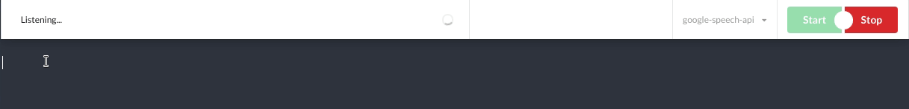

| MASTER | DEVELOP | Code Quality |
| --- | --- | --- |
| [](https://circleci.com/gh/natterjs/natter/tree/master) |[](https://circleci.com/gh/natterjs/natter/tree/develop) | [](https://app.codacy.com/app/natterjs/natter?utm_source=github.com&utm_medium=referral&utm_content=natterjs/natter&utm_campaign=Badge_Grade_Dashboard) |

| Linux | Windows | MacOS |
| ---| --- | --- |
| [](https://dev.azure.com/natterjs/natterjs/_build/latest?definitionId=1&branchName=develop) | [](https://dev.azure.com/natterjs/natterjs/_build/latest?definitionId=1&branchName=develop) | [](https://dev.azure.com/natterjs/natterjs/_build/latest?definitionId=1&branchName=develop)


##  Natter
_Programmable and extensible voice automation for Linux, MacOS, and Windows_



Natter is about making voice automation of a computer system independent of that system spec OR premium software. It does this by making the speech recognition system function (difficult part) as an adapter, that can be swapped in and out of your workflow as you try new speech to text tools.

**It’s designed for programmers to use and extend as they see fit.**

## Features

### API Integrations
Use natter to turn speech into text with a number of Web Speech API's:
- [x] Google
- [ ] IBM Watson
- [x] Wit.ai
- [ ] Mozilla Deep Speech

### Automation Intents
Automation intents are powered by the context of the application you are in. When in a `.doc` for example, you might want to just speak freely and note everything you say. In a `.js` file you will probably want access to some programming grammars...

### Grammar Designs
Design grammars that can implement macros, refactor text and control window focus:
- [x] Speech to text :: “Hi, who is there” => `hi, who is there`
- [ ] Speech to key bindings :: “slap down copy” => `{enter_key} {down_key} {control+c}`
- [ ] Transform text functions :: “sentence bring all your API’s” => `Bring all your API’s`
- [ ] Custom macros :: “jason key data value brackets number list 1 34 67” => `{ “data”: [ 1, 34. 67 ] }`

## Dependencies

Natter is an electron app which has distributed binaries, but you can clone it and run it locally if you want.

### Setup

#### LINUX

```
sudo apt-get install libxtst-dev libpng++-dev sox
```
#### MacOS

```
brew install sox
```

#### Boot

```
npm i && npm run demo
```

### Distribution

Currently the binaries are built via Microsoft Azure Pipelines.

These pipelines will produce zip files which can be stored at remote url's and downloaded.
